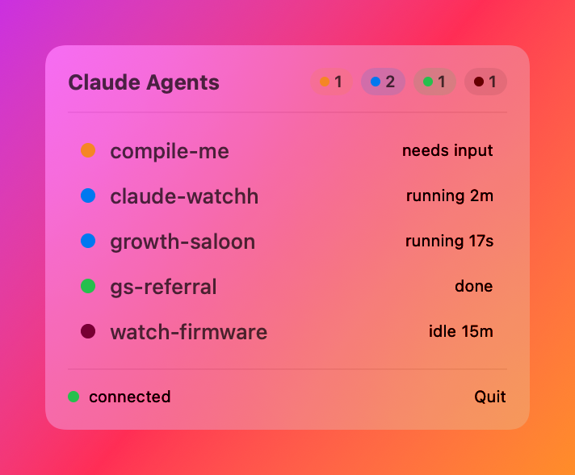

# Claude Watcher

Shows the live state of every Claude Code agent across your terminals — on a
wearable M5StickC Plus2 over Bluetooth LE, and/or in a native macOS menu bar
app. Both read the same daemon, so they work together or independently.

## Setup
1. Flash the watch: `cd firmware && pio run -t upload`
2. Daemon deps: `cd daemon && python3 -m venv .venv && source .venv/bin/activate && pip install -r requirements.txt`
3. Pair: `python claude_watch_daemon.py --scan` (saves the watch address to config.toml)
4. Install hooks: `bash hooks/install.sh`
5. Run: `cd daemon && source .venv/bin/activate && python claude_watch_daemon.py`
6. Auto-start at login (recommended): `bash daemon/install-launchd.sh` — installs a launchd agent so the daemon always runs after reboot and restarts if it crashes.

## States
- blue = running, green = done, amber = needs input, grey = idle, dim red = BLE disconnected
- Button A: per-session detail; Button B: back to summary
- Hold Button B at boot for a self-test color cycle

## Mac menu bar app

A native menu bar app (`macapp/`) shows every active Claude agent across all
projects, styled like Control Center. It reads the same daemon as the watch.



Build and run:

```bash
cd macapp && ./build.sh && open ClaudeWatchBar.app
```

What it does:
- **Live dashboard**: each agent row shows a tool-aware icon (terminal, pencil, magnifier…), the project, what it's doing ("running a command", "editing code"), and how long.
- **Menu bar badge**: the bar icon shows the count of agents waiting on you, so a glance is enough.
- **Notifications**: a sound + banner the moment an agent needs input or finishes.
- **Stuck detection**: an agent waiting on you 5+ minutes turns red so you don't forget it.
- **Click to focus**: click any row to jump to that agent's terminal tab (iTerm/Terminal by tty; VS Code is brought forward).
- **Right-click actions**: reveal the project in Finder, copy its path, or focus its terminal.
- **Animation**: running agents shimmer, waiting agents pulse.
- **Token usage**: a top summary with your **session (5-hour)** and **weekly** quota bars (% used + reset countdown, color-graded), plus a per-chat **context-fill %** on each row so you can see which chat is getting heavy. Fed by the status line (`hooks/install.sh` appends a one-time reporter to your status line script).
- **Usage alerts**: notifications when the session window crosses 80% / 95%, the weekly crosses 90%, or any chat's context passes 90% ("consider /compact"). The menu-bar icon shows the session % when you're near the wall.
- **Clickable notifications**: with `terminal-notifier` installed (`brew install terminal-notifier`), clicking a "needs you" banner jumps straight to that agent's terminal, and the banner shows the actual question. Without it, notifications still fire via `osascript` (just not clickable).
- **Detailed activity**: rows show the real action (`editing StatusModel.swift`, `$ npm run build`) and exactly what a blocked agent is asking.
- **Burn-rate ETA**: the session bar projects "~25m to limit" from how fast you're consuming.
- **Context trend** (↑) on chats whose context is climbing, and a **"Today · N tokens out"** total across all sessions.
- **Desktop widget**: the pop-out button (footer) detaches the panel into a draggable, always-on-top floating widget you can park anywhere; it remembers its spot and reopens if it was open last launch.
- **Quiet when you're looking**: notifications are suppressed for the terminal you're actively viewing (only background agents ping you). Needs Accessibility permission, granted on first launch; fails safe (still notifies) without it.
- **Settings** (gear in the footer): toggle notifications, sound, and launch-at-login.

How it works: the app polls `GET http://127.0.0.1:7459/status` once per second and
shows "daemon offline" when it can't reach the daemon. The daemon serves this
endpoint with or without the hardware watch — `python claude_watch_daemon.py
--mock` is enough to drive the menu bar app on its own.

Requires macOS 14+. The `build.sh` script compiles with SwiftPM and assembles a
menu-bar-only (`LSUIElement`) `.app` bundle — no Xcode GUI needed.

**Click-to-focus permission:** the first time you click a row, macOS asks to let
ClaudeWatchBar control your terminal (Automation permission). Approve it once and
focusing works thereafter. It never launches a terminal that isn't already open.

## Architecture
hooks (python3/urllib, 1s timeout) -> daemon (127.0.0.1:7459, aggregates)
  -> BLE -> watch
  -> GET /status (1s poll) -> macOS menu bar app
